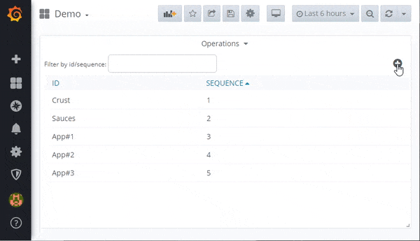
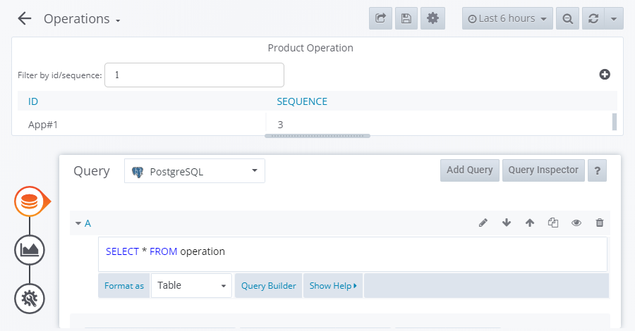

# Libre Operation CRUD Table Panel

> Libre Grafana panel for Create, Read, Update and Delete of Product Operations

This panel gives users the ability to search for, create, read, update and delete product operations as part of [Libre](https://github.com/Spruik/Libre). Operations are the ingredient steps that can applied to a product. This plugin interfaces to a no security json rest api for operations running on the same grafana server. This panel is targeted at Grafana v6.x.x only.

Operation objects have two properties.

1. name - Name of the operation _limited to 20 characters_
2. sequence - Order of display _>= 0_



## Installation

The easiest way to get started with this plugin is to [download the latest release](https://github.com/Spruik/Libre-Operation-CRUD-Table-Panel/releases/latest/download/libre-operation-crud-table-panel.zip), unzip into grafana plugin directory and restart grafana.

Download the latest release

```shell
$ wget https://github.com/Spruik/Libre-Operation-CRUD-Table-Panel/releases/latest/download/libre-operation-crud-table-panel.zip
Resolving github.com (github.com)... 140.82.114.4
...
2020-06-24 20:47:59 (1.08 MB/s) - 'libre-operation-crud-table-panel.zip' saved [90150]
```

Unzip into your Grafana plugin directory

```shell
$ unzip libre-operation-crud-table-panel.zip -d /var/lib/grafana/plugins
Archive: libre-operation-crud-table-panel.zip
...
inflating: /var/lib/grafana/libre-operation-crud-table-panel/utils.js.map
```

Restart Grafana

```shell
$ service grafana-server restart
 * Stopping Grafana Server
 * Starting Grafana Server
```

## Usage

In order to get the most out of this panel:

1. Add a *Table* metric to query operations. For example `SELECT * FROM operation`. This panel expects an id, name and sequence column.



2. Apply custom column styles:

| Column   | Type   | Name Override | Other                    |
|----------|--------|---------------|--------------------------|
| id       | hidden |       -       |   -                      |
| name     | String | ID            |   -                      |
| sequence | Number | SEQUENCE      | unit: short, decimals: 0 |

### Adding

Use the + icon to add in a new operation by providing a name and a sequence.

### Update / Delete

Click an existing operation so show the actions popup. Delete removes the object, whilst update shows a popup to edit and save an operation properties.

### Searching

Use the search box to filter the list of operations.

## Developing

### Getting Started

A docker-compose and grunt script is provided in order to quickly evaluate source code changes. This requires

Prerequisites

- docker (>= 18 required)
- docker-compose (>= 1.25 required)
- node (>= 12 required)
- npm (>= 6 required)

Start by cloning this repository

```shell
~/
$ git clone https://github.com/Spruik/Libre-Operation-CRUD-Table-Panel
Cloning into 'libre-operation-crud-table-panel'...
remote: Enumerating objects: 46, done.
remote: Counting objects: 100% (46/46), done.
remote: Compressing objects: 100% (31/31), done.
remote: Total 46 (delta 13), reused 46 (delta 13), pack-reused 0
Unpacking objects: 100% (46/46), done.
```

Enter project and install dependencies

```shell
$ cd ./libre-operation-crud-table-panel
~/libre-operation-crud-table-panel
$ npm install --silent
...
added 613 packages in 9.938s

```

Install Grunt globally

```shell
$ npm install grunt -g --silent
C:\Users\user\AppData\Roaming\npm\grunt -> C:\Users\user\AppData\Roaming\npm\node_modules\grunt\bin\grunt
+ grunt@1.2.1
updated 1 package in 5.748s
```

Run grunt to build the panel

```shell
$ grunt
Running "copy:src_to_dist" (copy) task
Created 3 directories, copied 9 files

Running "copy:libs" (copy) task


Running "copy:readme" (copy) task
Created 1 directory, copied 9 files

Running "string-replace:dist" (string-replace) task

1 files created

Running "copy:pluginDef" (copy) task
Copied 1 file

Running "babel:dist" (babel) task

Done.

```

Start docker-compose.dev.yml detached

```shell
~/libre-operation-crud-table-panel
$ docker-compose -f docker-compose.dev.yml up -d
Creating network "libre-operation-crud-table-panel_default" with the default driver
Starting libre-operation-crud-table-panel_postgres_1
Starting libre-operation-crud-table-panel_postrest_1
Starting libre-operation-crud-table-panel_simulator_1
Starting libre-operation-crud-table-panel_grafana_1
```

Run grunt watch to recompile on change

```shell
~/libre-operation-crud-table-panel
$ grunt watch
Running "watch" task
Waiting...
```

Open your favourite editor and start editing ./src files. The grunt watch task will detect this and recompile the panel. Use your favourite web browser and point to http://localhost:3000 login and create a dashboard with this panel. Your browser will need to be refreshed to reflect your changes to this panel, ensure your browser isn't caching files.

### Building

Prerequisites

- node (>= 12 required)
- npm (>= 6 required)

Build panel and zip into archive

```shell
~/libre-operation-crud-table-panel
$ grunt build
Running "clean:0" (clean) task
>> 1 path cleaned.

Running "clean:1" (clean) task
>> 1 path cleaned.

Running "copy:src_to_dist" (copy) task
Created 3 directories, copied 9 files

Running "copy:libs" (copy) task


Running "copy:readme" (copy) task
Created 1 directory, copied 9 files

Running "string-replace:dist" (string-replace) task

1 files created

Running "copy:pluginDef" (copy) task
Copied 1 file

Running "babel:dist" (babel) task

Running "compress:main" (compress) task
>> Compressed 45 files.

Running "compress:tar" (compress) task
>> Compressed 45 files.

Done.

```

Find a completed build of this panel in the root directory named `libre-operation-crud-table-panel.zip`.

## Contributing

For any issue, there are fundamentally three ways an individual can contribute:

- By opening the issue for discussion: For instance, if you believe that you have uncovered a bug in, creating a new issue in the [GitHub issue tracker](https://github.com/Spruik/Libre-Operation-CRUD-Table-Panel/issues) is the way to report it.
- By helping to triage the issue: This can be done either by providing supporting details (a test case that demonstrates a bug), or providing suggestions on how to address the issue.
- By helping to resolve the issue: Typically, this is done either in the form of demonstrating that the issue reported is not a problem after all, or more often, by opening a Pull Request that changes some bit of something in the panel in a concrete and reviewable manner.

## Change log

- 1.0.3 Npm Audit
  - Bump Revision
  - Upgrade bl from 1.2.2 to 1.2.3
  - Upgrade ini from 1.3.5 to 1.3.8

- 1.0.2 Add build tar artifact
  - Fix npm audit
  - Remove unused libraries
  - Add grunt compress tar
  - Update README outputs
  - Bump Revision

- 1.0.1 Documentation Updates
  - Fix package description
  - Fix typo & subtitle markdown

- 1.0.0 Initial Public Release
